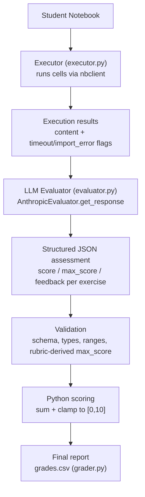

# NotebookGrader — Automated, rubric-based assessment of Python/Jupyter assignments

NotebookGrader is a CLI tool that grades batches of Jupyter notebook
submissions against an instructor-written rubric. It executes each notebook,
uses an LLM for the parts of grading that genuinely require semantic
judgment, and computes the final score deterministically in Python from a
validated, structured assessment — the LLM never returns an authoritative
grade directly. The current implementation calls Claude (Anthropic) as its
LLM backend; that's an implementation detail behind a small evaluator
interface, not the core design.

## Problem

Manually grading Python/Jupyter assignments at class scale is:

- Time-consuming — running each notebook and writing per-exercise feedback
  takes real time per student.
- Difficult to standardize — the same mistake can get graded differently
  depending on when in the pile it's reached.
- Difficult to reproduce — there's rarely a record of *why* a grade was what
  it was.
- Difficult to scale — the effort grows linearly with class size.

## Solution

NotebookGrader separates grading into stages with a clear division of
responsibility: execution and error detection are deterministic, semantic
judgment is delegated to an LLM, and the assessment it returns is validated
and scored by Python before it becomes a grade.

```text
Student Notebook
      ↓
Notebook execution
      ↓
Deterministic execution checks
      ↓
LLM-assisted semantic evaluation
      ↓
Structured assessment
      ↓
Validation
      ↓
Python scoring
      ↓
Final grade + feedback
```

The LLM is responsible for semantic assessment only — reading code and
judging whether it satisfies an exercise. Execution, validation, and scoring
are all deterministic Python logic.

## Architecture



This mirrors the actual modules: `executor.py` (execution), `evaluator.py`
(LLM call, response validation, scoring), and `grader.py` (CLI, batch loop,
CSV output). `grader.py` wraps each notebook's pipeline in its own
`try/except`, so a failure at any stage is caught, logged, and recorded for
that submission without stopping the batch.

## Key Design Decisions

**Deterministic execution.** Notebooks are actually run with `nbclient`
(`allow_errors=True`), so grading is based on real outputs, not a static
read of the code. Execution failures — timeouts, missing imports — are
detected deterministically before the LLM is involved.

**LLM-assisted semantic evaluation.** The LLM is used where judgment is
required: whether a particular approach satisfies an exercise, how to award
partial credit, and how to phrase specific feedback. These aren't things a
fixed rule can express well, which is exactly what an LLM is suited for.

**Structured output.** The LLM must respond with a strict JSON object — one
entry per exercise with `id`, `score`, `max_score`, `feedback`, and `issues`
— instead of free-form text.

**Validation.** `evaluator.py` validates the response before trusting it:
valid JSON, required/no-unexpected fields, numeric types, exercise ids and
count matching the rubric, and scores within range. Malformed or
out-of-range responses raise `LLMResponseError` rather than being silently
accepted.

**Python-controlled scoring.** The final grade is the sum of validated
per-exercise scores, clamped to `[0, 10]`, calculated by Python — never
taken verbatim from the LLM. Where `rubric.txt` follows the
`### Ejercicio N ... (X points)` heading convention, Python also parses the
rubric's own point values and uses them in place of whatever `max_score` the
LLM reported, so the LLM cannot silently redefine an exercise's weight.

**Fault tolerance.** Each notebook goes through the pipeline independently.
A corrupted file, an execution timeout, or an invalid LLM response is
caught, logged, and recorded against that submission alone — it does not
stop the rest of the batch.

## How It Works

1. **Configure** — point the CLI at an assignment folder containing
   `rubric.txt` and a `submissions/` directory (or pass a rubric/notebook
   path directly).
2. **Discover notebooks** — all `.ipynb` files under `submissions/` are
   collected and sorted.
3. **Execute** — each notebook is run with `nbclient`; cell errors don't
   stop execution of the rest of the notebook.
4. **Collect outputs/errors** — code, markdown, and cell outputs are
   flattened into text; timeouts and missing-import errors are flagged.
5. **Evaluate semantically** — the rubric and flattened notebook are sent to
   the LLM, requesting a structured per-exercise assessment.
6. **Validate the response** — schema, field, type, and range checks reject
   anything malformed before it's trusted.
7. **Calculate the score** — Python sums the validated per-exercise scores
   and clamps the total.
8. **Generate the final output** — one row per notebook is written to
   `grades.csv` (`filename, grade, comment`), and a batch summary is printed.

## Configuration / Rubrics

Grading criteria are not hard-coded — each assignment is a folder with its
own `rubric.txt`, so the same tool grades any assignment by pointing it at a
different folder:

```text
courses/
└── intro_python/
    ├── unidad2/
    │   ├── rubric.txt       ← grading criteria
    │   ├── submissions/     ← student .ipynb files
    │   └── grades.csv       ← output (generated)
    └── unidad3/
        ├── rubric.txt
        └── submissions/
```

`rubric.txt` is free text, sent verbatim to the LLM as part of the prompt.
A representative excerpt:

```text
### Ejercicio 1 — Variables (1 point)
- a) Numeric variable `a = 2` (0.5 pts)
- b) List of 3 fruits (0.5 pts)
```

Using the `### Ejercicio N — Title (X points)` heading format lets Python
independently parse each exercise's point value and cross-check it against
the LLM's response (see Validation above). A rubric that doesn't follow this
convention still works — Python falls back to trusting the LLM's
self-reported `max_score` per exercise.

## Example Output

Given the rubric excerpt above and an example submission cell:

```python
a = 2
frutas = ["manzana", "pera"]
print(a, frutas)
```

`grades.csv` (illustrative row, not a real student):

```text
filename,grade,comment
example_student.ipynb,0.5,"**Variables — 0.50/1.00 pts**

La variable numérica está bien definida. La lista de frutas debía tener 3 elementos y solo tiene 2.

- La lista `frutas` tiene 2 elementos en vez de 3

**Nota final: 0.50/10**"
```

A real rubric has multiple exercises; the final grade is the sum of all of
their validated per-exercise scores.

## Error Handling and Edge Cases

| Situation | Behaviour |
|---|---|
| Cell times out | Flagged as `timeout`; notebook is still graded on its written code |
| Missing import | Flagged as `import_error`; noted for the LLM rather than auto-failed |
| Notebook fails to execute / is corrupted | Exception caught, logged, and recorded in the CSV row for that file |
| Malformed or invalid LLM response | Rejected by schema validation (`LLMResponseError`), logged, and recorded in the CSV row |
| One notebook fails | The batch continues; the failure is isolated to that row |

## Testing

```text
tests/
├── test_executor.py    # valid notebooks, runtime errors, timeouts, missing imports
├── test_evaluator.py   # valid/malformed/incomplete/out-of-range LLM responses
├── test_grader.py      # end-to-end batch grading, batch isolation, CSV output
└── test_edge_cases.py  # empty notebooks, markdown-only notebooks, corrupted files
```

Run with:

```bash
uv run pytest
```

Tests target critical paths and failure modes rather than exhaustive
coverage (no coverage percentage has been measured). `evaluate_notebook`
accepts an injectable `LLMEvaluator`, so evaluator and grader tests use a
fake implementation — no real API calls are made during testing.

## Reproducibility / Installation

```bash
uv sync
.venv/bin/python -m ipykernel install --user --name python3
cp .env.example .env   # then set ANTHROPIC_API_KEY in .env
```

Dependencies are pinned in `uv.lock`, so `uv sync` reproduces the exact
environment on any machine. `.env` is gitignored and loaded automatically at
runtime via `python-dotenv`.

**Grade a full assignment:**
```bash
uv run grader.py --assignment ./courses/intro_python/unidad2
```

**Grade a single notebook:**
```bash
uv run grader.py --file ./submissions/student.ipynb --rubric ./rubric.txt
```

**Grade a folder manually:**
```bash
uv run grader.py --notebooks ./submissions --rubric ./rubric.txt --output grades.csv
```

## Evaluation

Formal evaluation against human grading is planned as a future milestone. A
representative anonymized dataset of submissions with human-assigned grades
will be collected before reporting agreement metrics.

No evaluation has been performed yet, and this README does not include any
evaluation metrics — measured or otherwise.

## Limitations

- **LLM variability** — semantic grading can vary slightly between runs or
  model versions; it is not bit-for-bit reproducible.
- **Rubric ambiguity** — `rubric.txt` is free text; underspecified exercises
  rely on the LLM's interpretation of the instructor's intent.
- **Semantic evaluation can disagree with human graders** — this has not
  been formally measured yet (see Evaluation above).
- **Rubric weight cross-checking is best-effort** — Python only overrides
  the LLM's self-reported `max_score` when `rubric.txt` follows the
  `### Ejercicio N ... (X points)` heading convention.
- **Execution environment dependencies** — notebook execution requires the
  `python3` Jupyter kernel to be installed; missing packages the student's
  code imports will surface as `import_error`, not a false negative.
- **Some cases likely need human review** — borderline pass/fail grades and
  exercises the rubric itself flags as ambiguous.

## Future Improvements

- Formal evaluation against human-assigned grades.
- Additional deterministic checks where practical (beyond timeout/import
  detection).
- Calibration review of LLM-assigned partial credit against instructor
  expectations.
- Support for an additional LLM provider behind the existing
  `LLMEvaluator` interface.
